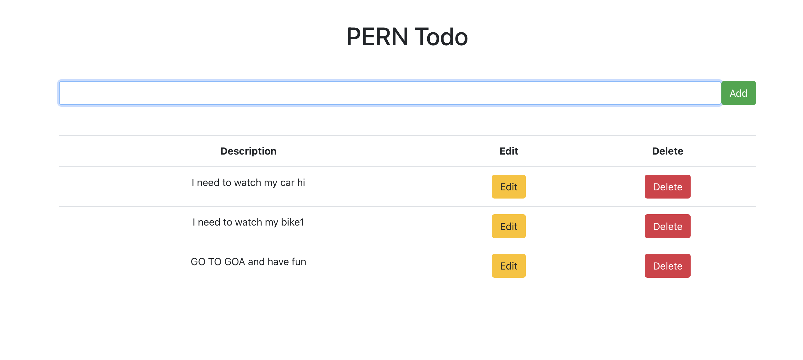
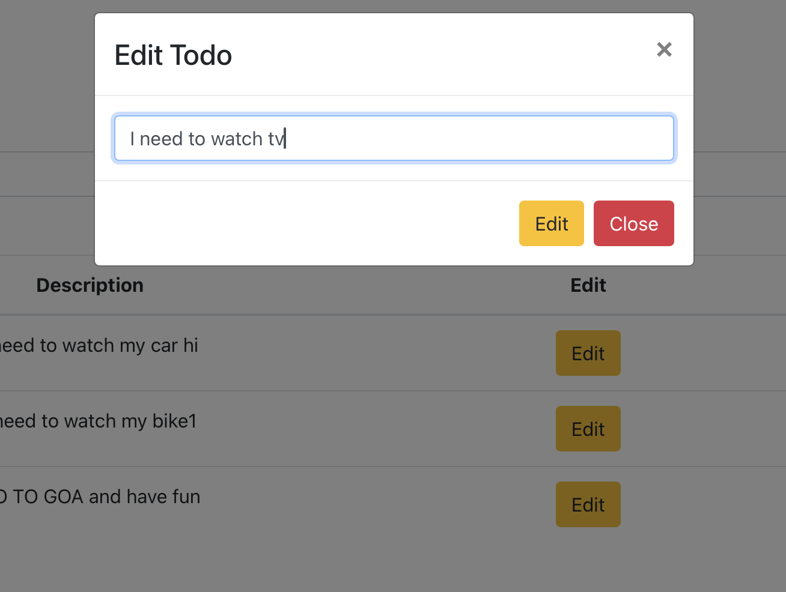
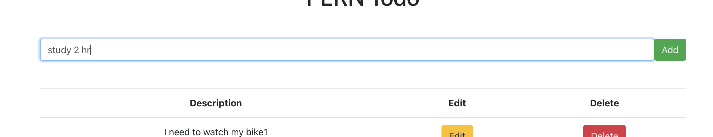

# pern-todo
A full-stack TODO application built with the PERN stack (PostgreSQL, Express, React, Node.js). Features include CRUD operations for task management using RestFul API, a responsive user interface, and seamless integration between the backend and database. Perfect for learning or deploying a simple task management solution.


# APP interface


# Updating todo content


# Creating a todo



# PERN TODO App

A full-stack TODO application built with the PERN stack (PostgreSQL, Express, React, Node.js). This app allows users to manage tasks with CRUD (Create, Read, Update, Delete) operations, offering a responsive and intuitive user interface. It integrates seamlessly with the backend and the PostgreSQL database.

## Features

- **Task Management:** Add, update, delete, and view tasks.
- **Responsive UI:** Optimized for both desktop and mobile devices.
- **Seamless Integration:** React frontend connected to Node.js backend and PostgreSQL database.

## Tech Stack

- **Frontend:** React
- **Backend:** Node.js, Express
- **Database:** PostgreSQL

## Installation

### Prerequisites

Make sure you have the following installed:

- Node.js
- PostgreSQL

### Clone the Repository

```bash
git clone https://github.com/your-username/pern-todo-app.git
cd pern-todo-app
s://facebook.github.io/create-react-app/docs/deployment) for more information.

### `npm run eject`

**Note: this is a one-way operation. Once you `eject`, you can't go back!**

If you aren't satisfied with the build tool and configuration choices, you can `eject` at any time. This command will remove the single build dependency from your project.

Instead, it will copy all the configuration files and the transitive dependencies (webpack, Babel, ESLint, etc) right into your project so you have full control over them. All of the commands except `eject` will still work, but they will point to the copied scripts so you can tweak them. At this point you're on your own.

You don't have to ever use `eject`. The curated feature set is suitable for small and middle deployments, and you shouldn't feel obligated to use this feature. However we understand that this tool wouldn't be useful if you couldn't customize it when you are ready for it.
